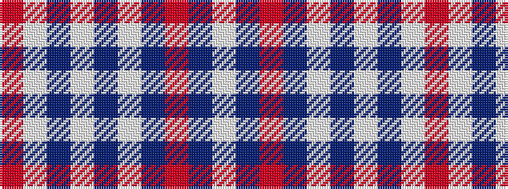

RWBWBWBRBW

It is a 10 stripe tartan.

<figure class="pat-woven">

<figcaption>idealised sample</figcaption>
</figure>

## Colour Sequence



## Tartans with this colour sequence

| Tartans |
|---------------|
| [Siddle (Name)](/variants/s10/r3w29db2w2db2w2db14r31db2w2~x2/)|
||
