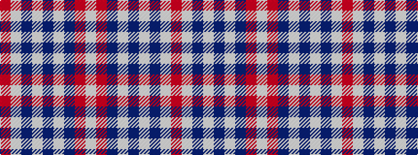

RWBWBWBRW

It is a 9 stripe tartan.

<figure class="pat-woven">

<figcaption>idealised sample</figcaption>
</figure>

## Colour Sequence



## Tartans with this colour sequence

| Tartans |
|---------------|
| [Stuart of Bute 2013 (Fashion)](/variants/s9/o16lb8n1lb2n1lb1n8o34w2~x2/)|
||
