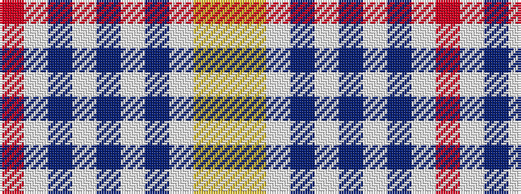

RWBWBWBWYY

It is a 10 stripe tartan.

<figure class="pat-woven">

<figcaption>idealised sample</figcaption>
</figure>

## Colour Sequence



## Tartans with this colour sequence

| Tartans |
|---------------|
| [Peter Rabbit™](/setts/s10/lr7lg2w2b5w3b7w5b14w5r5~x2/)|
||
