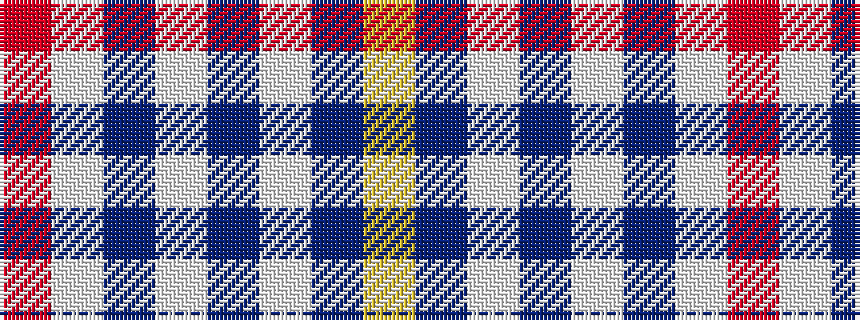

RWBWBWBY

It is a 8 stripe tartan.

<figure class="pat-woven">

<figcaption>idealised sample</figcaption>
</figure>

## Colour Sequence



## Tartans with this colour sequence

| Tartans |
|---------------|
| [North Vancouver Island](/setts/s8/r2w6db2w9db9w2db6ly2~x4/)|
||
| [North Vancouver, Island](/setts/s8/r2w6db2w9db9w2db6ly2~x2/)|
||
