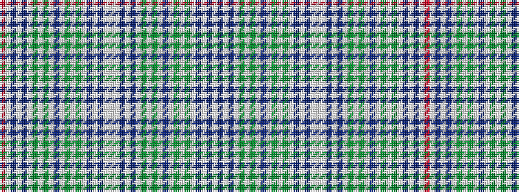

RWBWBWGWGWBWGWGWBWBWWWBWBWGWGWBWGWGWBWBW

It is a 40 stripe tartan.

<figure class="pat-woven">

<figcaption>idealised sample</figcaption>
</figure>

## Colour Sequence



## Tartans with this colour sequence

| Tartans |
|---------------|
| [Unidentified Scarlett #6](/setts/s40/w45db4w4db4w5g7w7g7w4db2w4g7w7g7w5db4w4db4w45lb8w45db4w4db4w5g7w7g7w4db2w4g7w7g7w5db4w4db4w45r8~x2/)|
||
