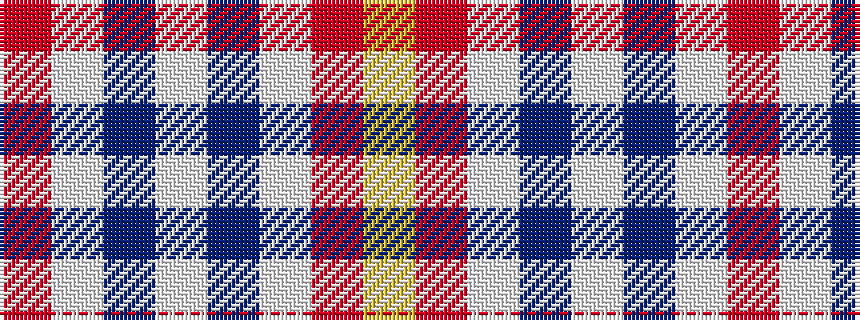

RWBWBWRY

It is a 8 stripe tartan.

<figure class="pat-woven">

<figcaption>idealised sample</figcaption>
</figure>

## Colour Sequence



## Tartans with this colour sequence

| Tartans |
|---------------|
| [Alloway Primary (Corporate)](/variants/s8/lb30db1w4o10ly18~x2/)|
||
