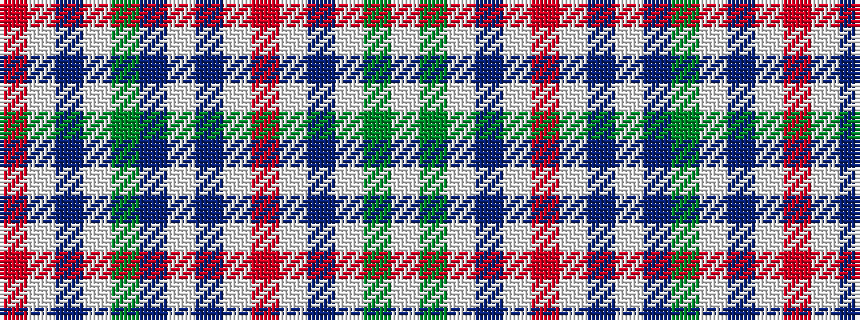

RWBWGBWBWRWBWGW

It is a 15 stripe tartan.

<figure class="pat-woven">

<figcaption>idealised sample</figcaption>
</figure>

## Colour Sequence



## Tartans with this colour sequence

| Tartans |
|---------------|
| [Portmeirion](/setts/s15/w56g5w5t10w33r14w5dp27w33t10g5w33dp27w5r14/)|
||
