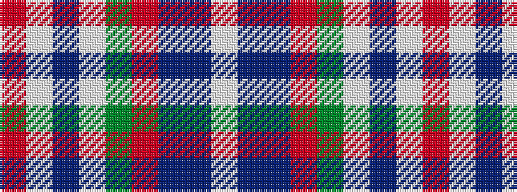

RWBWGRBBW

It is a 9 stripe tartan.

<figure class="pat-woven">

<figcaption>idealised sample</figcaption>
</figure>

## Colour Sequence



## Tartans with this colour sequence

| Tartans |
|---------------|
| [Spens (Lochcarron)](/setts/s9/r40w1db7w1g12r8db6t2w1~x2/)|
||
