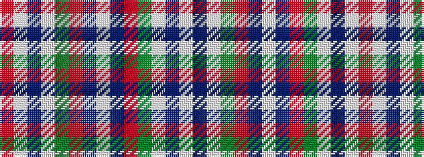

RWBWGRBWBRGWBW

It is a 14 stripe tartan.

<figure class="pat-woven">

<figcaption>idealised sample</figcaption>
</figure>

## Colour Sequence



## Tartans with this colour sequence

| Tartans |
|---------------|
| [Spens/Spence](/setts/s14/r56w2t6w2g32r11t6w5~x2/)|
||
