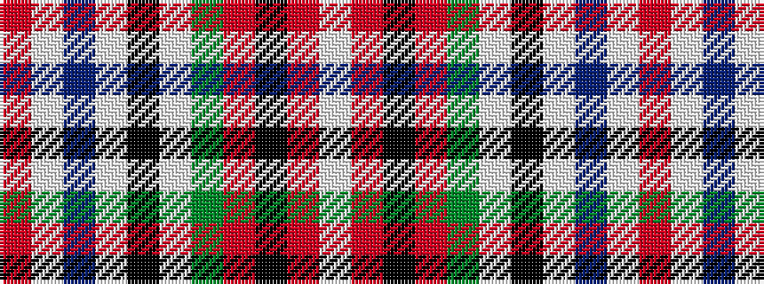

RWBWKWGRKRW

It is a 11 stripe tartan.

<figure class="pat-woven">

<figcaption>idealised sample</figcaption>
</figure>

## Colour Sequence



## Tartans with this colour sequence

| Tartans |
|---------------|
| [Rothesay, Duke of](/setts/s11/r2w28db4w2k6w2g7r4k1r2w1~x2/)|
||
