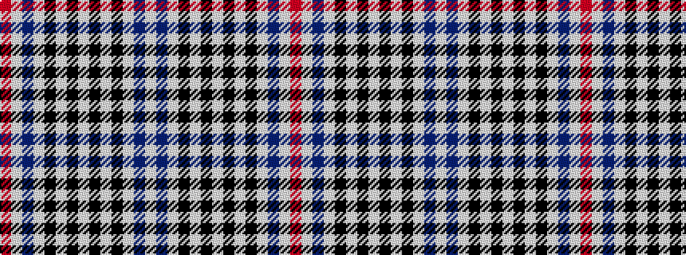

RWBWKWKWKWKWBW

It is a 14 stripe tartan.

<figure class="pat-woven">

<figcaption>idealised sample</figcaption>
</figure>

## Colour Sequence



## Tartans with this colour sequence

| Tartans |
|---------------|
| [Scott, Sir Walter #2](/variants/s14/w4k4w4k4w4db3w2r2~x2/)|
||
