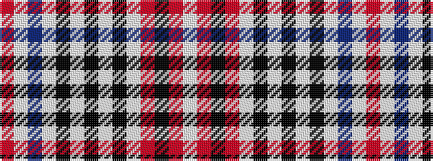

RWBWKWKWKWRKRW

It is a 14 stripe tartan.

<figure class="pat-woven">

<figcaption>idealised sample</figcaption>
</figure>

## Colour Sequence



## Tartans with this colour sequence

| Tartans |
|---------------|
| [Duke of Rothesay (Royal)](/variants/s14/r6w56db9w8k16w4k3w4k3w36r36k3r12w3~x2/)|
||
