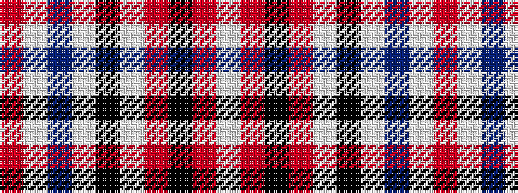

RWBWKWRKRW

It is a 10 stripe tartan.

<figure class="pat-woven">

<figcaption>idealised sample</figcaption>
</figure>

## Colour Sequence



## Tartans with this colour sequence

| Tartans |
|---------------|
| [Rothesay, Dress (VS)](/setts/s10/r2w28db4w2k6w2r4k1r2w1~x2/)|
||
