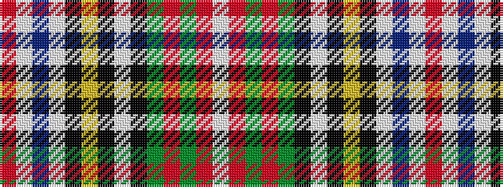

RWBWKYKWKGRGRW

It is a 14 stripe tartan.

<figure class="pat-woven">

<figcaption>idealised sample</figcaption>
</figure>

## Colour Sequence



## Tartans with this colour sequence

| Tartans |
|---------------|
| [Victoria Highland Dress](/variants/s14/r5w23db5w5k7ly3k3w2k3dg16r8dg3r6w3~x2/)|
||
