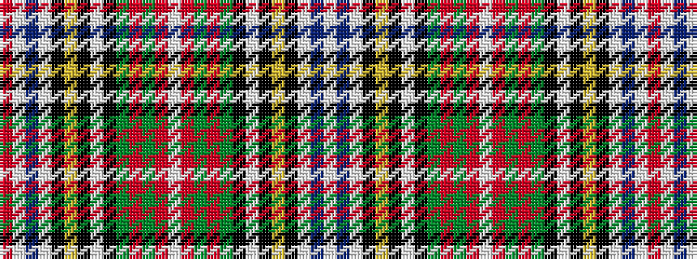

RWBWKYKWKGRGRWRGRGKWKYKWBW

It is a 26 stripe tartan.

<figure class="pat-woven">

<figcaption>idealised sample</figcaption>
</figure>

## Colour Sequence



## Tartans with this colour sequence

| Tartans |
|---------------|
| [Victoria Highland Dress Artifact Tartan](/variants/s26/w23db5w5k7ly3k3w2k3g16r8g3r6w3r6g3r8g16k3w2k3ly3k7w5db5w23r5~x2/)|
||
