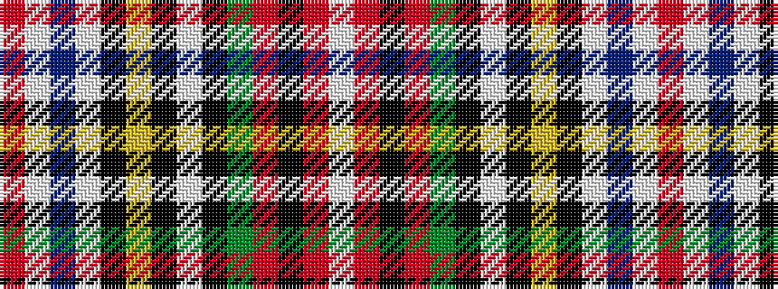

RWBWKYKWKGRKRW

It is a 14 stripe tartan.

<figure class="pat-woven">

<figcaption>idealised sample</figcaption>
</figure>

## Colour Sequence



## Tartans with this colour sequence

| Tartans |
|---------------|
| [Stewart Victoria](/variants/s14/r2w24t3w3k6ly1k1w1k1g8r4k1r2w1~x2/)|
||
| [Stewart Victoria (Royal)](/variants/s14/r2w24b3w3k6lo1k1w1k1g8r4k1r2w1~x4/)|
||
| [Stuart/Stewart Victoria](/variants/s14/r2w24t3w3k6ly1k1w1k1dg8r4k1r2w1~x2/)|
||
