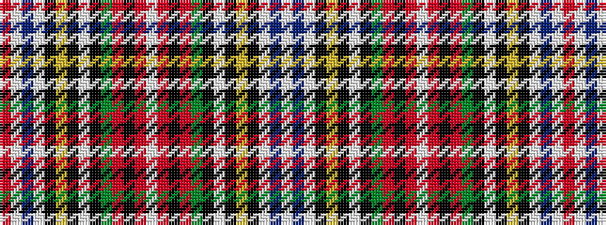

RWBWKYKWKGRKRWRKRGKWKYKWBW

It is a 26 stripe tartan.

<figure class="pat-woven">

<figcaption>idealised sample</figcaption>
</figure>

## Colour Sequence



## Tartans with this colour sequence

| Tartans |
|---------------|
| [Stewart Victoria](/setts/s26/lb24b3lb3k6lo1k1lb1k1g8r4k1r2lb1r2k1r4g8k1lb1k1lo1k6lb3b3lb24r2~x4/)|
||
