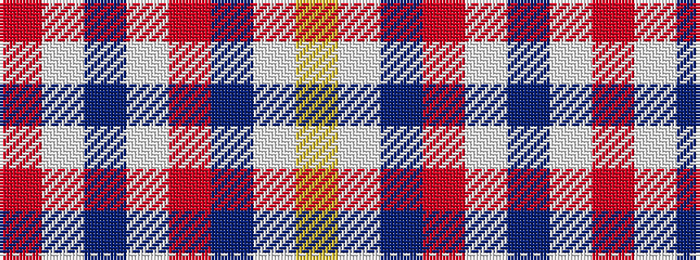

RWBWRBWY

It is a 8 stripe tartan.

<figure class="pat-woven">

<figcaption>idealised sample</figcaption>
</figure>

## Colour Sequence



## Tartans with this colour sequence

| Tartans |
|---------------|
| [Presley of Memphis](/setts/s8/r4w4db4w21r1db42w1ly4~x2/)|
||
