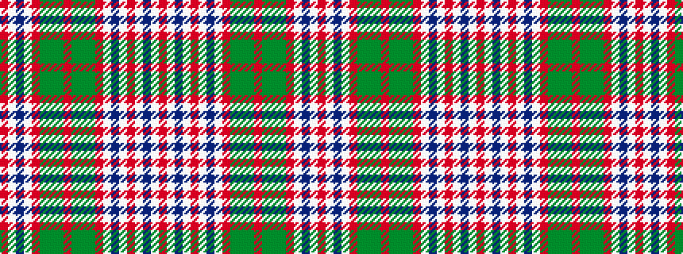

RWBWRGGGRGGGRWBWRWBWR

It is a 21 stripe tartan.

<figure class="pat-woven">

<figcaption>idealised sample</figcaption>
</figure>

## Colour Sequence



## Tartans with this colour sequence

| Tartans |
|---------------|
| [MacDonald of Boisdale](/variants/s21/r16lb1db7lb1r6lb1db34lb1r26g1gi16g1r4g1gi7g1r4lb1db7lb1r16~x2/)|
||
| [MacDonald of Boisdale](/variants/s21/r16w1db6w1r6w1db32w1r24gi1g16gi1r4gi1g6gi1r4w1db6w1r16~x2/)|
||
| [MacDonald of Boisdale Clan Tartan](/variants/s21/r16w1db6w1r6w1db32w1r24g1gi16g1r4g1gi6g1r4w1db6w1r16~x2/)|
||
