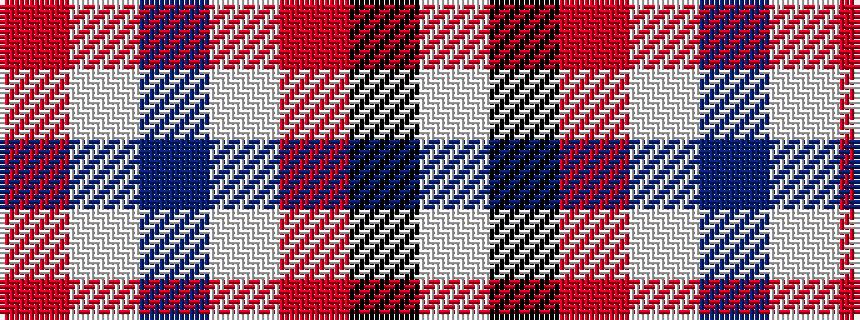

RWBWRKW

It is a 7 stripe tartan.

<figure class="pat-woven">

<figcaption>idealised sample</figcaption>
</figure>

## Colour Sequence



## Tartans with this colour sequence

| Tartans |
|---------------|
| [Tartan Tangerine](/setts/s7/o1w1dp4w1o4k1w1~x8/)|
||
