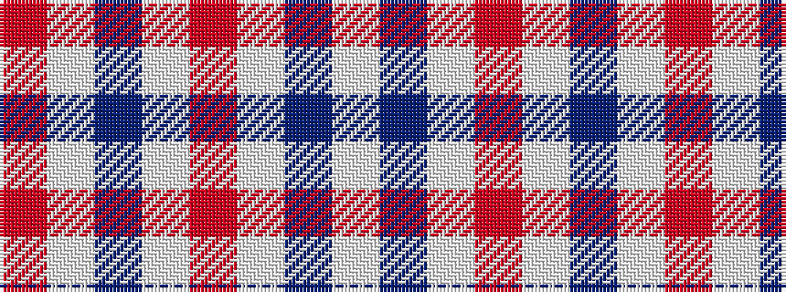

RWBWRWBW

It is a 8 stripe tartan.

<figure class="pat-woven">

<figcaption>idealised sample</figcaption>
</figure>

## Colour Sequence



## Tartans with this colour sequence

| Tartans |
|---------------|
| [Milne Purple Dress (Dance)](/variants/s8/w12db2w12m17w12db2w5r2~x4/)|
||
