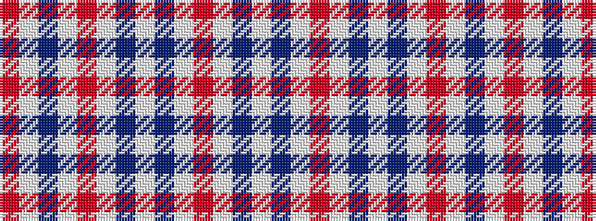

RWBWRWBWBWRWBW

It is a 14 stripe tartan.

<figure class="pat-woven">

<figcaption>idealised sample</figcaption>
</figure>

## Colour Sequence



## Tartans with this colour sequence

| Tartans |
|---------------|
| [Milne Purple Dress Tartan Tartan Number: 6548. Earliest known date: 1985 See #634 for history. Now a dance tartan from D C Dalgliesh. See products available Copyright © Blair Urquhart, Comrie, 2015](/setts/s14/w5db2w12m17w12db2w12db2w12m17w12db2w5r2~x4/)|
||
