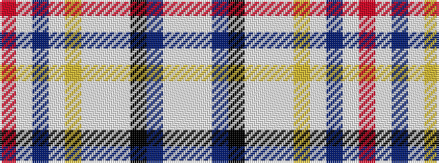

RWBWYWWWKBWW

It is a 12 stripe tartan.

<figure class="pat-woven">

<figcaption>idealised sample</figcaption>
</figure>

## Colour Sequence



## Tartans with this colour sequence

| Tartans |
|---------------|
| [St. Andrews Management School](/variants/s12/r5w2b2w2ly5w2lb2w2k7b14lb30w4~x2/)|
||
