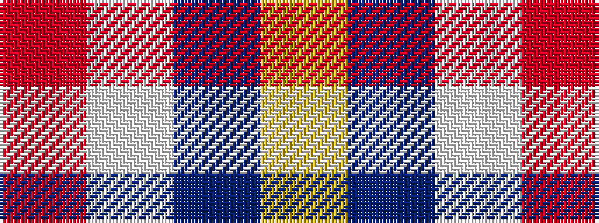

RWBY

It is a 4 stripe tartan.

<figure class="pat-woven">

<figcaption>idealised sample</figcaption>
</figure>

## Colour Sequence



## Tartans with this colour sequence

| Tartans |
|---------------|
| [MacRae of Conchra](/setts/s4/r1w8dt8ly1~x4/)|
||
| [MacRae of Conchra #3](/setts/s4/r7w36db36ly7~x2/)|
||
