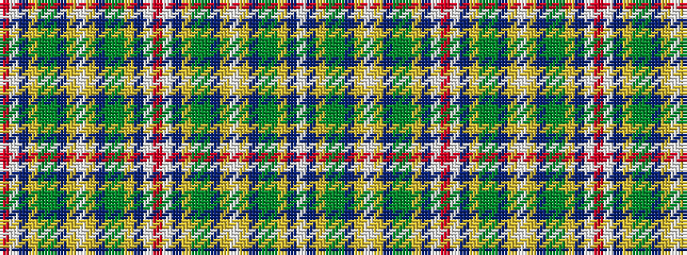

RWBYGGBYWYBGGYBWRWBYGGBYWYBGGYBW

It is a 32 stripe tartan.

<figure class="pat-woven">

<figcaption>idealised sample</figcaption>
</figure>

## Colour Sequence



## Tartans with this colour sequence

| Tartans |
|---------------|
| [Spens Fragment](/setts/s32/r50w2db7lo2gi33g12db7lo3w2lo3db7g12gi33lo2db7w2r17~x2/)|
||
