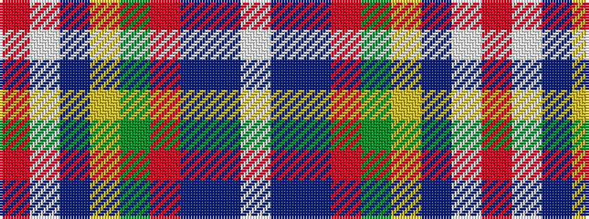

RWBYGRBBW

It is a 9 stripe tartan.

<figure class="pat-woven">

<figcaption>idealised sample</figcaption>
</figure>

## Colour Sequence



## Tartans with this colour sequence

| Tartans |
|---------------|
| [Drummond of Perth](/setts/s9/r36w1db3ly1g16r8db3t2w1~x2/)|
||
| [Drummond of Perth (Clan)](/setts/s9/r36w1db3ly1g16r8db3b2w1~x2/)|
||
| [Perthshire or Drummond District Tartan Tartan Number: 1670. Earliest known date: c.1819 Perthshire is known as the gateway to the Highlands. The Perthshire tartan is similar to a the Drummond sett, the tartan of a Drummond clan who had extensive lands in the district. The first record of this tartan is in the early nineteenth century account book of Wilson's of Bannockburn where it is referred to as the 'Perthshire Rock and Wheel' being an early type of soft tartan. See products available Copyright © Blair Urquhart, Comrie, 2015](/setts/s9/r41w2dp5ly2g21r9dp5db3w2~x2/)|
|![Perthshire or Drummond District Tartan Tartan Number: 1670. Earliest known date: c.1819 Perthshire is known as the gateway to the Highlands. The Perthshire tartan is similar to a the Drummond sett, the tartan of a Drummond clan who had extensive lands in the district. The first record of this tartan is in the early nineteenth century account book of Wilson's of Bannockburn where it is referred to as the 'Perthshire Rock and Wheel' being an early type of soft tartan. See products available Copyright © Blair Urquhart, Comrie, 2015 example sett](/setts/s9/r41w2dp5ly2g21r9dp5db3w2~x2/sett.png)|
| [Perthshire or Drummond of Perth](/setts/s9/r36w1db3ly1dg16r8db3t2w1~x2/)|
||
| [Perthshire, or Drummond](/setts/s9/r41w2p5ly2g21r9p5db3w2~x2/)|
||
