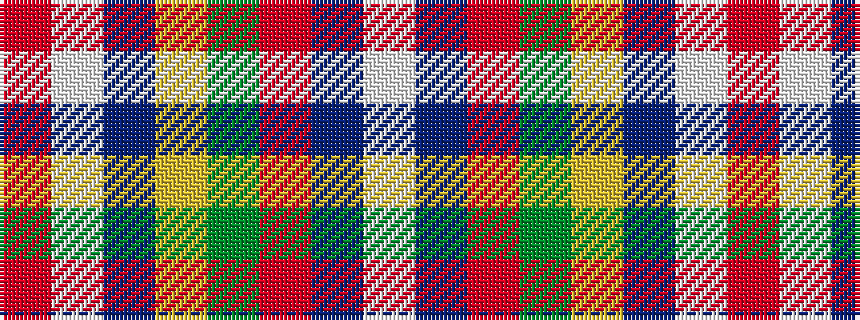

RWBYGRBW

It is a 8 stripe tartan.

<figure class="pat-woven">

<figcaption>idealised sample</figcaption>
</figure>

## Colour Sequence



## Tartans with this colour sequence

| Tartans |
|---------------|
| [Drummond of Perth](/variants/s8/r36lb1db3ly1dg16r8db3lb5/)|
||
