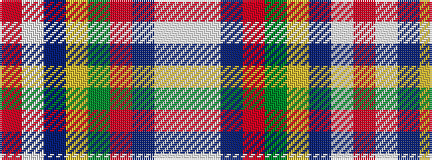

RWBYGRBWW

It is a 9 stripe tartan.

<figure class="pat-woven">

<figcaption>idealised sample</figcaption>
</figure>

## Colour Sequence



## Tartans with this colour sequence

| Tartans |
|---------------|
| [Perth - 1819 (District)](/variants/s9/r30w1dp4ly1dg14r6dp4lt2w1~x4/)|
||
