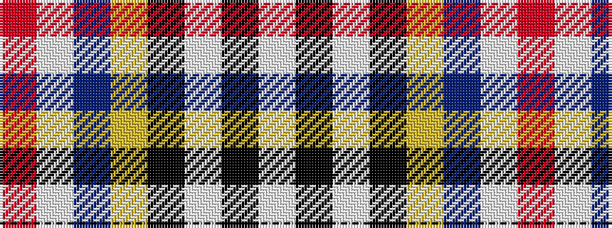

RWBYKWKW

It is a 8 stripe tartan.

<figure class="pat-woven">

<figcaption>idealised sample</figcaption>
</figure>

## Colour Sequence



## Tartans with this colour sequence

| Tartans |
|---------------|
| [Ailsa Craig (District)](/variants/s8/r5w2t20ly2k16w18k2w5~x2/)|
||
| [Ailsa, Craig](/variants/s8/r5w2db20ly2k16w18k2w5~x2/)|
||
