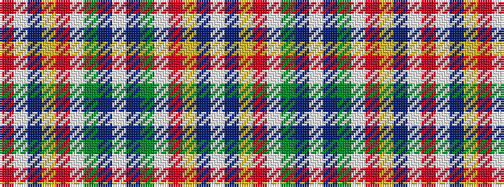

RWBYRWGBWBGWRYBW

It is a 16 stripe tartan.

<figure class="pat-woven">

<figcaption>idealised sample</figcaption>
</figure>

## Colour Sequence



## Tartans with this colour sequence

| Tartans |
|---------------|
| [Norwich No.014](/setts/s16/r22lt3db5ly2r2w2dg11db4w3~x2/)|
||
