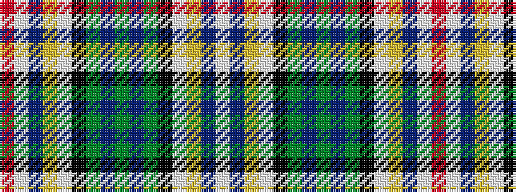

RWBYWKGBGBGKWYBW

It is a 16 stripe tartan.

<figure class="pat-woven">

<figcaption>idealised sample</figcaption>
</figure>

## Colour Sequence



## Tartans with this colour sequence

| Tartans |
|---------------|
| [Haymarket Dress (Dance)](/setts/s16/y2dt8y2k5w12lo1dt1w1r1~x4/)|
||
