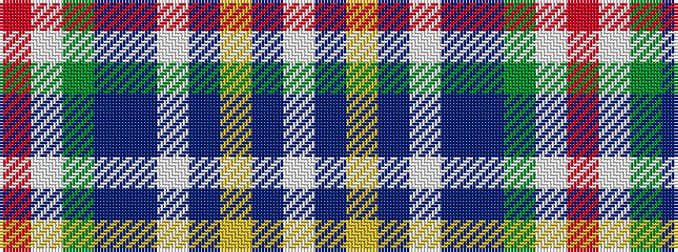

RWGBBWBYBW

It is a 10 stripe tartan.

<figure class="pat-woven">

<figcaption>idealised sample</figcaption>
</figure>

## Colour Sequence



## Tartans with this colour sequence

| Tartans |
|---------------|
| [Miss Emma Halford-MacLeod](/setts/s10/w102dt3ly3dt3w3dt12n14g12w3o3~x2/)|
||
