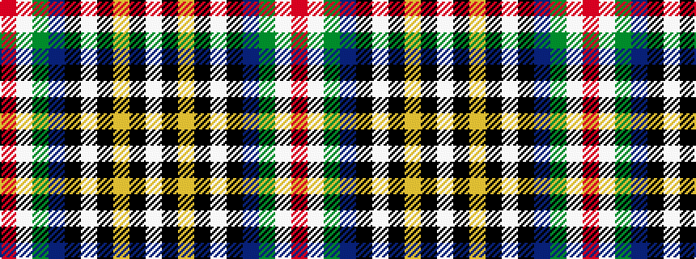

RWGBKWKYKW

It is a 10 stripe tartan.

<figure class="pat-woven">

<figcaption>idealised sample</figcaption>
</figure>

## Colour Sequence



## Tartans with this colour sequence

| Tartans |
|---------------|
| [Halford-Macleod, Miss Emma (Personal](/variants/s10/w102k3lo3k3w3k12db14g12w3r3~x2/)|
||
