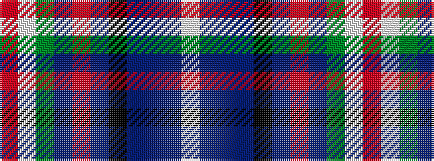

RWGBRBKBBBW

It is a 11 stripe tartan.

<figure class="pat-woven">

<figcaption>idealised sample</figcaption>
</figure>

## Colour Sequence



## Tartans with this colour sequence

| Tartans |
|---------------|
| [Fitzgerald, hunting](/setts/s11/w2db3t3db13k13db4r2db4g12lp3r1~x2/)|
||
