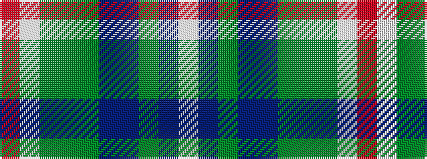

RWGGGBBGBW

It is a 10 stripe tartan.

<figure class="pat-woven">

<figcaption>idealised sample</figcaption>
</figure>

## Colour Sequence



## Tartans with this colour sequence

| Tartans |
|---------------|
| [Tupper, John Charles (Personal)](/variants/s10/r2w2dg8g2dg2db20t8g2db15w2~x2/)|
||
