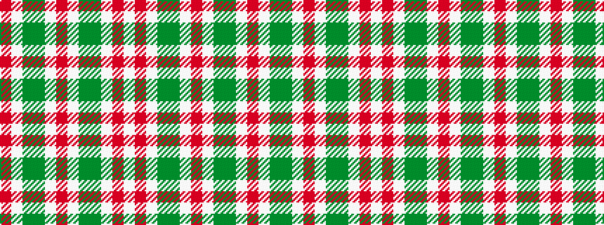

RWGGWRWGGWRW

It is a 12 stripe tartan.

<figure class="pat-woven">

<figcaption>idealised sample</figcaption>
</figure>

## Colour Sequence



## Tartans with this colour sequence

| Tartans |
|---------------|
| [Unidentified Arisaid #2](/variants/s12/r30w24dg15g15w24r30w24g15dg15w24r30w23~x2/)|
||
