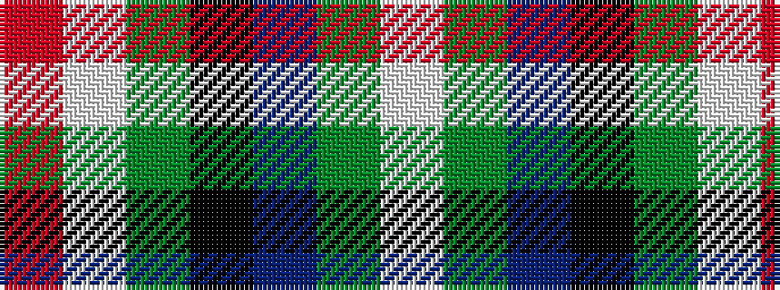

RWGKBGW

It is a 7 stripe tartan.

<figure class="pat-woven">

<figcaption>idealised sample</figcaption>
</figure>

## Colour Sequence



## Tartans with this colour sequence

| Tartans |
|---------------|
| [Royal British Legion (Corporate)](/setts/s7/r3lb2g20k3db8g2lb2~x2/)|
||
