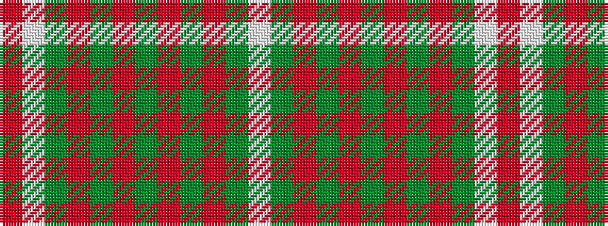

RWGRGRGRGRGW

It is a 12 stripe tartan.

<figure class="pat-woven">

<figcaption>idealised sample</figcaption>
</figure>

## Colour Sequence



## Tartans with this colour sequence

| Tartans |
|---------------|
| [Princess Marina #2](/setts/s12/r2lb22g3r2g2r3g2r3g2r3g2w2~x4/)|
||
| [Princess Marina (Fashion)](/setts/s12/w2g2r3g2r3g2r3g2r2g3lb13r1~x4/)|
||
