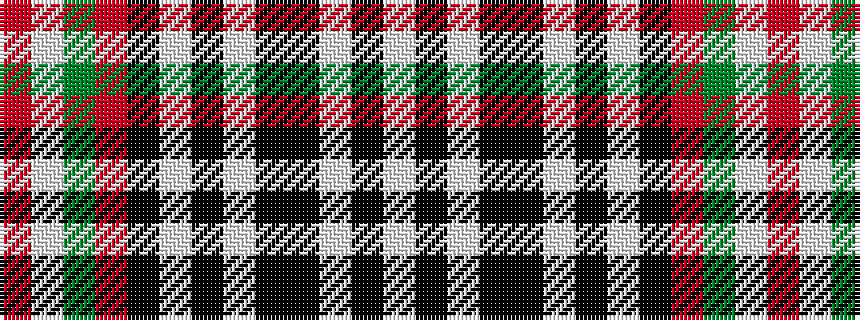

RWGRKWKWKKWKW

It is a 13 stripe tartan.

<figure class="pat-woven">

<figcaption>idealised sample</figcaption>
</figure>

## Colour Sequence



## Tartans with this colour sequence

| Tartans |
|---------------|
| [Niagara Celtic Heritage Festival](/setts/s13/r3w2g8r8k16w2k3w2k16ki8w8ki2w3~x2/)|
||
