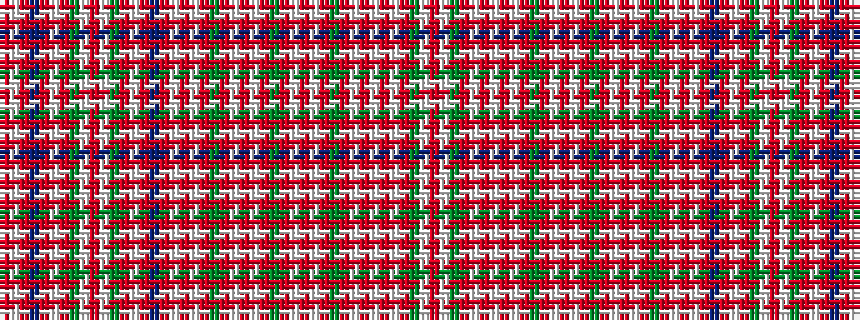

RWGRWRWRWRGRWRWRGRWRWRGRWRWRBRWRGWRWGRWRBRWR

It is a 44 stripe tartan.

<figure class="pat-woven">

<figcaption>idealised sample</figcaption>
</figure>

## Colour Sequence



## Tartans with this colour sequence

| Tartans |
|---------------|
| [MacAlister](/setts/s44/r8lb1dg2r2lb1r1lb1r1lb1r2dg3r1lb1r6lb1r1dg12r1lb1r16lb1r1dg12r1lb1r6lb1r1db4r1lb1r2dg3lb1r2lb1dg3r3lb1r1db2r1lb1r8/)|
||
