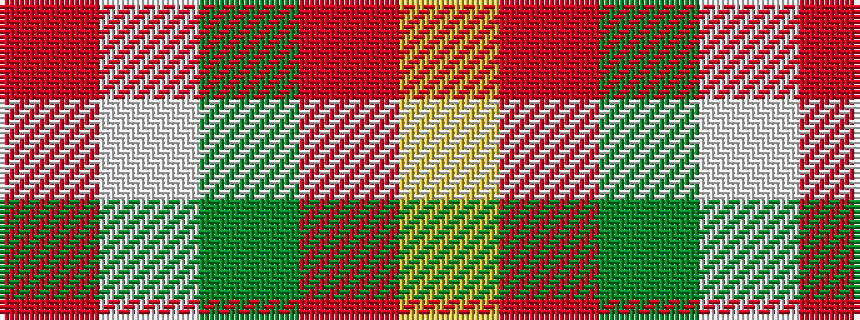

RWGRY

It is a 5 stripe tartan.

<figure class="pat-woven">

<figcaption>idealised sample</figcaption>
</figure>

## Colour Sequence



## Tartans with this colour sequence

| Tartans |
|---------------|
| [Jahore District Tartan](/variants/s5/o57w5g20o5ly10/)|
||
| [Johore (District)](/variants/s5/o57w5g20o5lo10~x2/)|
||
