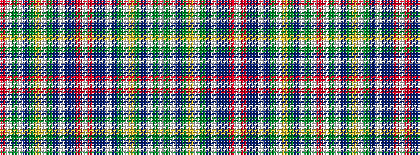

RWGWBGYWGBWBBRWRBBWBGWYGBWGW

It is a 28 stripe tartan.

<figure class="pat-woven">

<figcaption>idealised sample</figcaption>
</figure>

## Colour Sequence



## Tartans with this colour sequence

| Tartans |
|---------------|
| [Unnamed C18th - Prince Charles Edward](/setts/s28/r16w4dy100w4db34g30ly10w3g16dp12w4db16do64r26w4/)|
||
