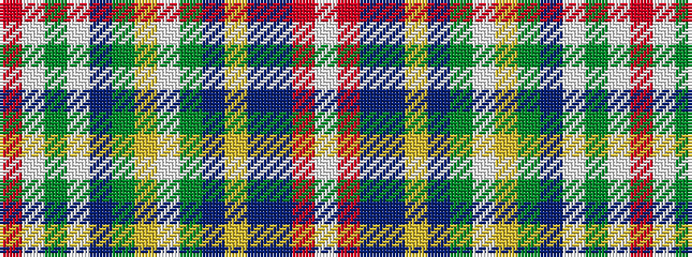

RWGWBGYWGBYBBRW

It is a 15 stripe tartan.

<figure class="pat-woven">

<figcaption>idealised sample</figcaption>
</figure>

## Colour Sequence



## Tartans with this colour sequence

| Tartans |
|---------------|
| [Stuart/Stewart Plaid](/variants/s15/r6w2dy40w2t14dg14ly3w2dg6dp6ly2t6dp30r12w2~x2/)|
||
