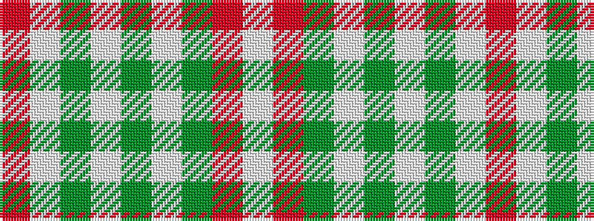

RWGWGWGRW

It is a 9 stripe tartan.

<figure class="pat-woven">

<figcaption>idealised sample</figcaption>
</figure>

## Colour Sequence



## Tartans with this colour sequence

| Tartans |
|---------------|
| [Stuart of Bute St Colmac](/variants/s9/o16lb8dy1lb2dy1lb1dy8o34w2~x2/)|
||
