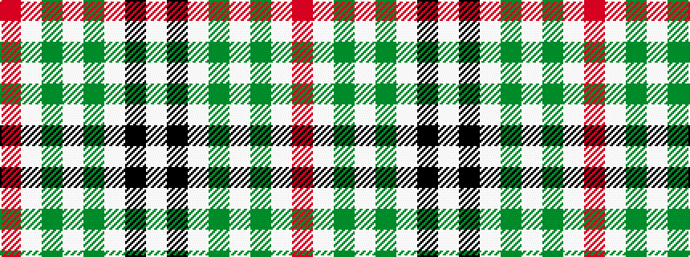

RWGWGWKW

It is a 8 stripe tartan.

<figure class="pat-woven">

<figcaption>idealised sample</figcaption>
</figure>

## Colour Sequence



## Tartans with this colour sequence

| Tartans |
|---------------|
| [St. Piran Dress](/variants/s8/r4w19dg2w8dg2w8k38w4~x2/)|
||
