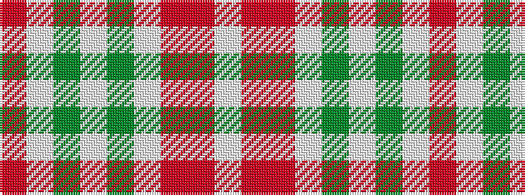

RWGWGWRRW

It is a 9 stripe tartan.

<figure class="pat-woven">

<figcaption>idealised sample</figcaption>
</figure>

## Colour Sequence



## Tartans with this colour sequence

| Tartans |
|---------------|
| [Royal Pharmaceutical, Society](/setts/s9/o3lb2g19lb6g2lb6oi14m4w2~x2/)|
||
