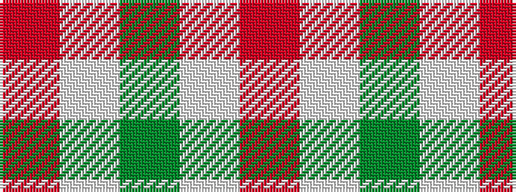

RWGWR

It is a 5 stripe tartan.

<figure class="pat-woven">

<figcaption>idealised sample</figcaption>
</figure>

## Colour Sequence



## Tartans with this colour sequence

| Tartans |
|---------------|
| [Daughter of Mull](/variants/s5/r1w1g1lb1m1~x16/)|
||
