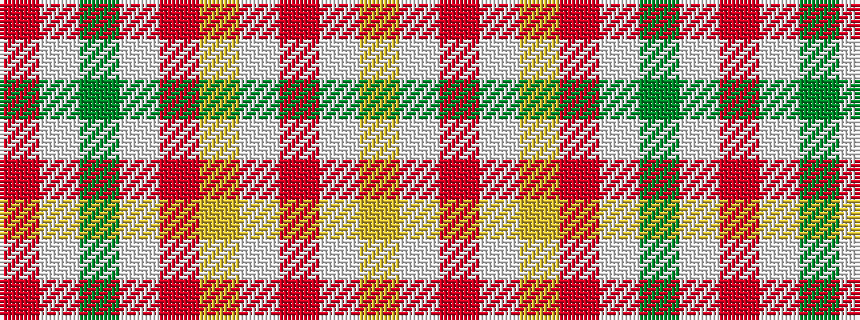

RWGWRYWRWY

It is a 10 stripe tartan.

<figure class="pat-woven">

<figcaption>idealised sample</figcaption>
</figure>

## Colour Sequence



## Tartans with this colour sequence

| Tartans |
|---------------|
| [Smith Hunting (Name)](/variants/s10/lo60w1r15w1lo9r15w1y9w1r15~x2/)|
||
