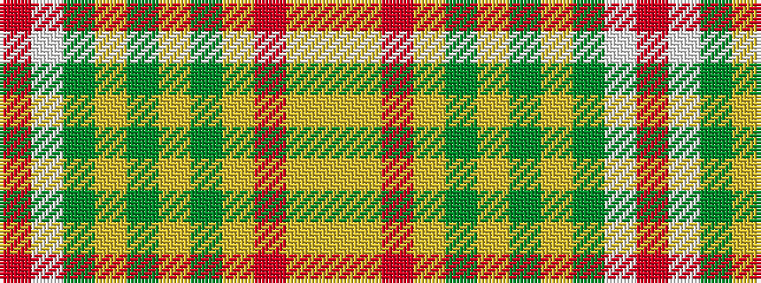

RWGYGYGYRYY

It is a 11 stripe tartan.

<figure class="pat-woven">

<figcaption>idealised sample</figcaption>
</figure>

## Colour Sequence



## Tartans with this colour sequence

| Tartans |
|---------------|
| [Tasmanian](/variants/s11/r5lp2y24lr2y2lr2y6lr8r6lr8ly4~x2/)|
||
