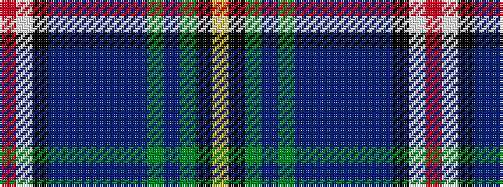

RWKBBBBBBGBGKY

It is a 14 stripe tartan.

<figure class="pat-woven">

<figcaption>idealised sample</figcaption>
</figure>

## Colour Sequence



## Tartans with this colour sequence

| Tartans |
|---------------|
| [Robert Lee Jordan Defiance (Per.)](/variants/s14/r3w5k1dt24dp3dt4dp3dt3dp12dg3dp1dg21k1ly3~x2/)|
||
